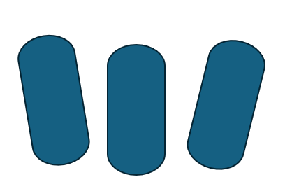
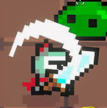

# SsalMuk 게임 기획서

- 작성일: 2026-09-16
- 상태: A~D 기본 기능 구현 · Windows 플레이 빌드 준비 · 사용자 지시로 D3 추가 검사 종료(30분 미완료) · 다음은 실제 플레이·밸런스 조정
- 작업 프로젝트: `C:\Users\ace21\Desktop\SsalMuk`
- 진행 순서: 게임 기획 정리 → 구조 설계 → Unity 연결 및 개발·수정·검증

이 문서는 게임의 동작과 플레이 경험을 정한다. 승인한 디자인 패턴, 아키텍처, FSM, 길찾기와 코드 구조는 [구조 설계](../superpowers/specs/2026-09-16-ssalmuk-architecture-design.md)에, 개발·수정·검증 환경은 [개발 하네스 설계](../development/HARNESS.md)에 정리한다. 구체적인 실행 순서는 [구현 계획](../superpowers/plans/2026-09-16-ssalmuk-implementation-plan.md)에 연결한다. **확정된 규칙과 구조**, **임시 테스트 프리셋**, **나중에 조정할 수치**를 구분한다. 문서의 작성은 실제 구현·연결·검증 완료를 의미하지 않는다.

## 1. 게임의 중심

플레이어가 레벨업 보상을 직접 선택하고, low AI가 이동·경험치 수집·전투 운영을 대신하는 방치형 뱀서라이크다. 공격은 자동으로 실행된다.

AI가 위험을 감수하며 경험치를 챙기고 포위 상황을 돌파하는 모습을 보면서, 플레이어는 무기 조합과 강화 방향을 결정한다. 조작의 중심은 직접 이동하거나 공격하는 것이 아니라 전투 중 계속 주어지는 성장 선택이다.

한 판은 사망할 때까지 이어지는 무한 생존이다. 보스 처치는 클리어 조건이 아니다. 사망하면 해당 판의 성장 내역을 초기화한다.

## 2. 시작과 한 판의 흐름

### 확정 기획

1. 플레이어가 `GameStart` 버튼을 누른다.
2. 전투 씬을 로드한다.
3. 초기 맵과 구조물을 생성한다.
4. 플레이어를 생성한다. 시작 무기는 검으로 고정한다.
5. 몬스터를 생성한다.
6. 자동 전투를 시작한다.
7. 이동·전투·경험치 수집·레벨업 선택을 반복한다.
8. 플레이어가 사망하면 해당 판을 끝내고 성장 내역을 초기화한다.
9. 종료한 판의 결과를 확인하고 다시 시작하거나 메인 메뉴로 돌아간다.

전투에 필요한 맵·구조물·플레이어·몬스터는 씬에 미리 배치하지 않고 실행 중 생성한다. 초기 생성에는 위의 순서가 있다. 전투가 시작된 뒤에는 맵 확장과 몬스터 출현이 계속된다.

레벨업 선택창을 열어도 전투는 멈추지 않는다. 선택 중에도 low AI의 이동, 자동 공격, 몬스터 행동, 피격과 경험치 수집이 계속된다.

생존 시간은 초기 생성이 끝나 자동 전투를 시작하는 시점부터 측정하는 것을 기본 기준으로 삼는다. 씬 로드와 초기 생성에 걸린 시간은 포함하지 않으며, 레벨업 선택 중에도 계속 흐른다. 생존 시간에 따른 난이도와 보스의 5분 출현 주기도 이 기준을 따른다.

### 사망 시 초기화

- 획득한 무기와 각 무기의 강화 내역
- 캐릭터 레벨과 경험치 등 해당 판의 성장 상태
- 아직 사용하지 않은 레벨업 선택 기회

다음 판에 성장 효과를 누적하는 영구 강화는 적용하지 않는다. 다음 판도 검을 가지고 새로 시작한다.

### 사망 결과와 다음 행동

사망 결과 화면에 종료한 판의 **생존 시간·처치 수·플레이어의 최종 레벨**을 표시한다. 성장 상태를 초기화하더라도 결과 화면에는 종료한 판의 기록을 표시한다.

- **다시 시작:** 새 전투 씬을 로드하고 초기 맵·구조물 → 플레이어 → 몬스터 생성 순서로 새 판을 시작한다.
- **메인 메뉴:** `GameStart` 버튼이 있는 메인 메뉴로 돌아간다.

## 3. 플레이어와 low AI의 역할

| 주체 | 역할 |
| --- | --- |
| 플레이어 | 게임 시작, 레벨업 선택지에서 무기 또는 특정 무기의 업그레이드 선택, 사망 후 다시 시작 또는 메인 메뉴 선택 |
| low AI | 이동 입력, 위험 회피, 바닥에 떨어진 경험치 수집, 포위 판단과 탈출 방향 결정 |
| 자동 공격 | 목표를 정하고 보유한 무기의 공격 실행 |

대화에서 나온 D키 등 이동키는 이동 입력을 설명하기 위한 예시다. 실제 플레이에서 이 입력은 low AI가 대신한다.

### 이동 운영

- 바닥에 떨어진 경험치를 적극적으로 수집한다.
- 위험을 완전히 피하는 운영보다, 적과의 간격을 조절하면서 위험한 위치의 경험치도 노리는 공격적인 운영을 지향한다.
- 직접적인 충돌 위험이 커지면 적을 피한다.
- 주변의 일정 범위에서 적이 대부분의 이동 경로를 막으면 포위 상황으로 판단한다.
- 포위되면 AI가 탈출 방향 하나를 정하고, 그 방향으로 길을 뚫어 빠져나간다.

AI는 피격과 사망이 가능한 전투 규칙 안에서 경험치 수집과 탈출을 선택한다.

### 공격 목표

| 상황 | 공격 목표 |
| --- | --- |
| 평상시 | 가장 가까운 적 |
| 포위 돌파 중 | 선택한 탈출 방향을 막는 적 우선 |
| 포위에서 탈출한 뒤 | 가장 가까운 적을 선택하는 기본 규칙으로 복귀 |

목표 선택 규칙은 모든 무기에 공통으로 적용한다. 실제로 피해를 주는 모양은 각 무기의 공격 형태를 따른다.

구체적인 FSM 상태·위험 평가·탈출 방향·종료 조건은 승인된 구조 설계와 구현 계획 B1을 따른다. 이 문단은 행동의 목적을 정하며 정확한 임계값과 거리는 임시 프리셋으로 구현한 뒤 조정한다.

### 플레이어 피격 반응과 보호

플레이어가 실제로 피해를 받으면 몬스터와 비슷한 피격 느낌을 준다. 스프라이트가 빨간색으로 1회 점멸하고, 커졌다가 원래 크기로 돌아오며, 뒤로 넉백된다.

- 플레이어가 피해를 받으면 짧은 무적 시간을 적용한다.
- 이 시간 동안 추가 피해를 막아 한순간에 여러 번 피해를 받지 않게 한다.
- 무적 시간이 끝나면 다시 피해를 받을 수 있다.
- 무적 시간은 짧게 유지하며, 정확한 지속 시간은 밸런스 조정에서 정한다.

## 4. 플레이어의 시각적 움직임

플레이어는 스프라이트 한 장으로 이동하는 느낌을 낸다. 스프라이트 바닥을 기울임의 기준점으로 두고, 기울기와 상하 움직임을 반복한다.

**왼쪽으로 기울며 상승 → 정자세로 돌아오며 하강 → 오른쪽으로 기울며 상승 → 정자세로 돌아오며 하강**

- 걷는 연출의 기준은 low AI의 이동 입력이다.
- 이동 입력이 있을 때 걷는 연출을 재생한다.
- 정지 상태에서는 본체가 정자세를 유지한다.
- 공격 자체가 걷는 연출을 시작시키지는 않는다.
- 본체에 별도의 공격 모션을 넣지 않고, 무기가 나타나 공격하는 느낌으로 표현한다.
- 이동하지 않는 동안에도 목표를 자동 공격한다.

플레이어와 몬스터의 2D 스프라이트는 AI로 제작할 수 있다. 같은 화풍·시점·픽셀 밀도를 맞춘 투명 배경의 단일 스프라이트를 사용한다. 2026-09-17 사용자 지시에 따라 좌우 기울임·상하 점프 보행은 플레이어에만 적용한다. 일반·공중·보스는 정자세로 이동하며 피격 점멸·팽창·넉백은 유지한다. 공격 이펙트는 공개된 2D 에셋을 조사해 활용한다. 제작 방향과 조사 후보는 [아트·이펙트 기준](ART_AND_VFX.md)에 정리한다.

아래 이미지는 사용자가 제공한 기울기 참고 그림이다. 확정된 스프라이트 원화가 아니다.

## 5. 무기 4종

여러 종류의 무기를 동시에 장착할 수 있다. 시작 무기는 검이며, 나머지 무기는 레벨업 선택을 통해 획득한다.

추가 사용자 지시: 무기 외형은 도트 스타일의 **철검·철도끼·철창·끝에 루비가 달린 금색 마법 지팡이**로 제작한다. 지팡이는 파이어볼의 발사 무기 표시이며 기존 무기 4종·강화 5종 규칙을 유지한다.

| 무기 | 기본 공격 형태 | 공격 범위 강화 시 변화 |
| --- | --- | --- |
| 검 | 전방 60도 범위로 휘두름 | 60도 각도를 유지하면서 베는 거리 증가 |
| 창 | 전방으로 내지름 | 찌르는 거리 증가 |
| 대형 도끼 | 플레이어 주변을 한 바퀴 회전하는 공격 | 회전 공격 반경 증가 |
| 파이어볼 | 원거리로 발사되며 첫 적에게 명중하면 폭발하고 소멸하는 마법 공격, 소모 코스트 없음 | 폭발 반경 증가 |

검·창·파이어볼은 선택한 목표를 향해 공격한다. 대형 도끼는 목표 선택 규칙을 공유하되 공격 형태는 한 바퀴 회전으로 유지한다.

파이어볼은 첫 적에게 명중한 위치에서 폭발하고 투사체가 사라진다. 적을 관통하지 않으며, 폭발 범위 안의 적들에게 피해를 준다.

공격 범위는 사용자가 제공한 이미지 느낌의 반투명 효과로 표현한다. 아래 이미지는 공격 범위의 느낌을 설명하는 참고 자료이며, 그대로 사용할 게임 에셋으로 확정한 것은 아니다.

타격 중복 기준과 공격 예약 방식은 승인된 구조 설계를 따른다. 무기별 타격 간격의 정확한 수치는 임시 프리셋으로 구현한 뒤 조정한다.

## 6. 무기별 업그레이드 5종

업그레이드는 보유 무기 전체에 공통 적용하지 않고, 선택지에 표시된 특정 무기에 적용한다.

| 업그레이드 | 효과 |
| --- | --- |
| 공격력 증가 | 해당 무기의 공격력 증가 |
| 무기 개수 증가 | 해당 무기의 좌우에 하나씩 추가 |
| 연속 공격 횟수 증가 | 해당 무기가 한 번의 공격 묶음에서 연속으로 공격하는 횟수 증가 |
| 공격 속도 증가 | 해당 무기의 공격 주기가 빨라짐 |
| 공격 범위 증가 | 해당 무기의 베기 거리, 찌르기 거리, 회전 반경 또는 폭발 반경 증가 |

무기 종류를 새로 얻는 것과, 이미 가진 무기의 개수를 늘리는 것은 별개의 선택이다.

모든 업그레이드는 최대 강화 단계 없이 계속 누적된다. 무기 4종을 모두 얻어도 성장은 끝나지 않는다. 강화당 증가량과 증가 방식은 밸런스 조정 항목이며, 구조 설계에서 임의로 최대 강화 단계를 추가하지 않는다.

## 7. 레벨업과 선택지

### 후보 구성

레벨업 때 다음 두 범주에서 확률에 따라 선택지가 등장한다.

1. 보유한 무기의 5종 업그레이드
2. 아직 보유하지 않은 무기

| 보유 상태 | 등장할 수 있는 선택 |
| --- | --- |
| 검만 보유 | 검의 5종 업그레이드, 창·대형 도끼·파이어볼 획득 |
| 검과 추가 무기 보유 | 보유 무기 각각의 5종 업그레이드, 아직 없는 무기 획득 |
| 4종 모두 보유 | 4종 각각의 업그레이드만 등장 |

이미 획득한 무기는 새 무기 획득 후보에서 제외한다. 새 무기를 얻으면 그 무기의 업그레이드가 이후 선택 후보에 추가된다. 무기가 등장하는 경우와 업그레이드만 등장하는 경우 모두 가능하다.

무기와 업그레이드의 구체적인 등장 확률은 아직 정하지 않았다. 위 표가 모든 후보의 동일 확률을 의미하지는 않는다.

### 선택 기회의 누적

- 레벨업 선택 중에도 전투를 계속한다.
- 보상을 선택하기 전에 다시 레벨업하면 선택 기회를 누적한다.
- 하나를 고르면 다음 선택 기회를 제시한다.
- 이후 선택은 갱신된 무기 보유 상태를 반영해야 한다.
- 사망하면 남은 선택 기회도 해당 판과 함께 종료한다.

### 선택지 표시

한 번에 중복 없이 서로 다른 선택지 3개를 제시한다. 같은 무기의 획득 선택이나 같은 무기의 같은 업그레이드는 한 화면에 중복해서 나오지 않는다. 검 공격력 증가와 창 공격력 증가처럼 대상 무기가 다르면 서로 다른 선택지다.

중복 제한은 한 번에 제시하는 3개 사이에만 적용한다. 다음 선택 기회에는 같은 업그레이드가 다시 등장할 수 있다.

## 8. 몬스터와 난이도

| 종류 | 기획 |
| --- | --- |
| 일반 몬스터 | 플레이어를 추적하고 몸이 닿으면 피해를 주는 기본 전투 몬스터. 이동에 FSM과 길찾기를 적용 |
| 공중 몬스터 | 뱀파이어 서바이버즈의 박쥐 같은 역할. 화면 끝에서 플레이어를 향한 직선 경로로 지나가며 접촉 피해를 유발 |
| 거대 몬스터 | 플레이어를 추적하고 몸이 닿으면 피해를 주는 보스. 별도의 고유 공격 패턴 없이 기본 능력치를 높게 설정 |

- 생존 시간이 길어질수록 몬스터의 수와 능력치가 증가한다.
- 일반 몬스터는 맵 전체의 동시 존재 수에 상한을 둔다. 초기 생성과 지속 소환을 합산하고 화면 밖 개체도 포함한다. 상한에 도달하면 추가 일반 소환을 건너뛰며 대기량으로 적립하지 않는다. 기존 개체는 유지하고 빈자리가 생기면 다음 소환 일정부터 재개한다. `normalPopulationCap`의 임시값은 300이며 최종 수치는 나중에 조정한다. 공중·보스·경험치에는 이 상한을 적용하지 않는다(2026-09-17 사용자 지시).
- 공중 몬스터는 주기적으로 화면 한쪽에서 무리로 등장한다. 구체적인 등장 간격과 마릿수는 밸런스 조정에서 정한다.
- 보스는 **5분마다** 등장한다.
- 이전 보스가 살아 있어도 새 보스를 추가로 생성한다. 여러 보스가 동시에 존재할 수 있다.
- 보스를 처치해도 게임을 끝내지 않고 무한 생존을 이어간다.

일반·거대 몬스터는 서로 부딪히며 밀집할 수 있다. 공중 몬스터는 지상 몬스터의 밀집과 구조물을 무시하고 직선으로 통과한다. 공중 몬스터의 플레이어 접촉 피해는 유지한다.

### 공통 피격 표현

몬스터가 피해를 받으면 다음 반응을 보인다.

- 스프라이트가 빨간색으로 1회 점멸한다.
- 스프라이트가 커졌다가 원래 크기로 돌아온다.
- 뒤로 넉백된다.

공중 몬스터는 피격으로 넉백된 뒤 원래 진행 방향으로 다시 직진한다.

크기 변화량, 점멸 시간, 넉백 거리와 지속 시간은 나중에 조정한다. 보스를 포함한 대상별 넉백 강도는 밸런스 조정에서 정한다.

## 9. 무한 맵과 경험치

- 뱀파이어 서바이버즈처럼 플레이가 이어지는 방향으로 맵이 계속 생성된다.
- 시작 시 초기 맵과 구조물을 먼저 생성한다.
- 구조물은 플레이어와 지상 몬스터가 통과할 수 없고 공격으로 파괴되지 않는 장애물이다.
- 플레이어와 몬스터의 이동에는 길찾기를 적용한다.
- 바닥에 떨어진 경험치를 수집해 레벨업한다.
- 멀리 벗어난 구역의 경험치와 일반·보스 몬스터를 계속 유지한다. 공중 무리는 직선 돌진 후 진행 방향으로 화면 밖 여유 거리를 통과하면 퇴장한다. 퇴장은 처치·경험치를 주지 않는다.

플레이어와 지상 몬스터는 구조물을 우회해야 한다. 공중 몬스터는 구조물도 무시하고 직선으로 통과하며, 구조물 때문에 이동 경로를 우회하지 않는다.

화면 밖 보존은 구조 설계 대화에서 확정했으며, 2026-09-17 사용자 설명에 따라 공중 무리의 돌진 후 퇴장을 예외로 정정했다. 화면 밖에서 진입 중인 공중 개체는 유지하고 넉백이 끝나 원래 비행으로 돌아온 뒤 퇴장을 판단한다. 현재 퇴장 여유 거리는 화면 경계 밖 4월드 단위이며 몸 반경까지 벗어나야 한다. 사망한 몬스터, 수집한 경험치, 종료한 판은 정상 규칙에 따라 정리한다.

### 경험치 구슬과 흡수

- 경험치는 바닥에 떨어지는 **작고 동그란 원형 구슬**이다.
- 경험치 양은 **초록 < 파랑 < 빨강** 순으로 많다. 각 색의 구슬은 밝은 중심과 주변의 빛 번짐으로 발광하는 느낌을 준다.
- 플레이어가 가까이 가면 구슬이 플레이어를 향해 날아오기 시작한다.
- 가까워진 순간에는 경험치를 더하지 않는다. **구슬이 플레이어에게 닿는 순간에만 해당 값을 한 번 더한다.**
- 흡수를 시작한 구슬은 움직이는 플레이어를 따라가며, 구조물과 몬스터에 막히지 않게 처리한다. low AI는 이미 날아오는 구슬을 다시 쫓지 않는다.
- 바닥에서 대기 중인 구슬은 기존 위치를 유지한다. 흡수 중인 구슬은 현재 위치와 상태를 유지하며, 화면 밖이라는 이유로 삭제하거나 미리 획득 처리하지 않는다.
- 플레이어가 사망하면 추가 경험치를 얻지 않는다. 이전 판의 흡수나 표시 효과가 새 판에 경험치를 전달하지 않는다.

색별 경험치 값·구분 기준, 흡수 시작 거리·이동 속도·빛 번짐의 강도는 조정 가능한 수치다. 이 변경은 2026-09-16 사용자 지시를 반영하며, 실제 구현 완료를 의미하지 않는다.

## 10. 구조 설계와 밸런스 조정으로 넘길 항목

핵심 플레이 규칙은 위에 정리했다. 알고리즘과 상태 구조는 승인된 구조 설계를 따르며, 아래 항목의 최종 밸런스 수치는 구현 뒤 조정한다. 구현 계획의 임시 수치는 최종 밸런스 확정을 의미하지 않는다.

| 항목 | 후속 단계에서 결정할 내용 |
| --- | --- |
| 공중 무리의 출현 설정 | 화면 한쪽을 시드 난수로 고르는 구조를 채택. 구체적인 간격·마릿수 조정 |
| 접촉 피해 수치 | 피해 주기와 짧은 피격 무적의 정확한 지속 시간을 밸런스 조정에서 결정 |
| 선택지 등장 확률 | 신규 무기와 보유 무기 업그레이드의 등장 확률을 밸런스 조정에서 결정 |

체력·피해량·경험치 요구량·강화 증가량·스폰 수·이동 속도·공격 주기·범위·넉백 수치 등은 아직 수치표를 확정하지 않는다. 특정 값을 가정해서 기획에 없는 제한이나 면역을 만들지 않는다.

## 11. 학습자료 요구사항과 적용 방향

자료의 수업 조건과 권장 예시를 구분한다. 자료에 있는 모든 패턴 이름을 전부 적용한다는 뜻으로 해석하지 않는다.

| 근거 | 요구 또는 권장 | 현재 기획과의 연결 |
| --- | --- | --- |
| `26년도 플밍 1.서론.pdf` 4쪽 | 적과 싸우는 전투 게임, 세미나에서 제시하는 개념 적용 | 자동 전투 뱀서라이크로 충족할 방향 |
| 같은 자료 5쪽 | AI 사용 가능, 구현 방식을 이해하고 설명할 수 있어야 함 | 구조 선택의 이유와 실제 동작을 설명할 수 있도록 개발·검증 |
| 같은 자료 6쪽 | 수업 운영은 2인 1조 페어 프로그래밍 | 게임 기능과 구분되는 수업 운영 조건 |
| 같은 자료 8쪽, `26년도 플밍 2. 설계.pdf` 2쪽 | 맵 생성·FSM·길찾기가 이후 학습 주제로 제시됨 | 무한 맵 생성, 플레이어와 몬스터의 FSM 및 길찾기로 연결 |
| `26년도 플밍 2. 설계.pdf` 5쪽 | 자동 유닛 생성, 공격에 따른 체력 감소, 체력 UI 표시 | 시작 시 자동 생성 흐름과 전투·체력 UI에 반영 |
| 같은 자료 5쪽 | 제시된 디자인 패턴 최소 1~2개, 아키텍처 1개 적용 및 설명 | Factory Method·Flyweight·MVP 채택. A2에서 공유 정의와 유닛 팩토리, A5에서 메뉴·월드 MVP 연결 구현 |
| 같은 자료 5쪽 | 생성 패턴 하나와 구조 패턴 하나의 조합을 권장 | 강제 조합으로 확정하지 않음 |
| 같은 자료 12쪽 | 공통 데이터를 고려한 `unit.cs` 부모 구조를 권장 | UnitModel에 공통 상태를 두고 세 종류 모델과 조합된 행동으로 구성 |

자료에 제시된 MVP·MVC·MVVM 중 MVP를 채택하고 A5 메뉴·월드 표시에 적용했다. 자료의 실습 지시와 사용자의 실행 요청은 구분한다.

## 12. 개발 하네스의 목적과 현재 규칙

여기서 하네스는 게임 속 low AI의 실행기를 뜻하지 않는다. 사용자와의 대화로 개발 규칙을 정하고, Codex가 그 규칙에 따라 개발·수정·검증하는 작업 환경이다.

### 이미 정한 작업 규칙

- 실제 작업 프로젝트는 `C:\Users\ace21\Desktop\SsalMuk`이다.
- 게임 기획을 먼저 정리하고, 그 결과로 구조를 설계한 뒤 Unity 작업을 진행한다.
- 해당 프로젝트에서 작업하고, 작업 단위를 확인한 뒤 커밋하는 흐름으로 진행한다.
- Unity를 제어할 MCP를 설치·적용하고 대상 프로젝트 연결을 실제 읽기 요청으로 확인한다. A1에서 설치와 연결 확인을 완료했다.
- 일반 진행·완료 보고는 짧게 한다.
- 사용자가 상세 내용·원인·해결 방법·로그를 요청했을 때 `log.md`를 작성하거나 갱신한다.

### 개발·검증 규칙

1. 구현 전에 이번 작업이 어느 기획 항목을 충족하는지 확인한다.
2. 미확정 제안을 확정 규칙처럼 구현하지 않는다. 동작을 바꾸는 선택은 대화에서 정리한다.
3. 기존 사용자 변경을 보존하고, 이번 작업에 속한 변경만 커밋한다.
4. 씬이 열리거나 화면이 보인다는 사실과 실제 플레이 규칙이 동작한다는 사실을 구분한다.
5. 변경한 동작에 맞는 검증을 수행하고, 확인하지 못한 항목은 성공했다고 보고하지 않는다.
6. 저장소 밖으로의 공개·푸시는 로컬 작업과 커밋 지시에 포함된 것으로 간주하지 않는다.

구체적인 도구 구성, 검증 결과 계약, 기록 위치와 코드·씬 수정 방식은 [개발 하네스 설계](../development/HARNESS.md)에 정리했다. A1~A5의 기반·맵·이동·런타임 생성 검증을 수행했으며, AI·피해·성장 검증은 해당 기능 구현 단계에서 이어간다.

### 기획에서 도출되는 검증 기준

아래는 향후 개발 결과를 판단할 기준이다. 현재 기능이 구현되었거나 검증을 통과했다는 의미가 아니다.

| 확인 상황 | 기대하는 결과 |
| --- | --- |
| `GameStart` 실행 | 씬 로드 후 초기 맵·구조물 → 플레이어 → 몬스터 순서로 생성되고 자동 전투 시작 |
| 기본 플레이 | 사람이 이동키를 누르지 않아도 low AI가 이동하고 경험치를 수집 |
| 정지 중 공격 | 본체는 정자세이며 무기는 목표를 자동 공격 |
| 파이어볼 명중 | 첫 적에게 명중한 위치에서 폭발하고 투사체 소멸. 적을 관통하지 않으며 폭발 범위 안의 적들에게 피해 |
| 이동 입력 발생 | 스프라이트 한 장의 기울임·상하 움직임 반복 |
| 평상시 목표 선택 | 가장 가까운 적을 기준으로 공격 |
| 포위 상황 | 탈출 방향을 정하고 그 방향을 막는 적을 우선 공격하며 돌파 |
| 탈출 이후 | 가장 가까운 적을 공격하는 기본 규칙으로 복귀 |
| 레벨업 선택 중 | 전투와 경험치 수집이 멈추지 않음 |
| 레벨업 선택지 표시 | 한 번에 서로 다른 선택지 3개 제시. 같은 화면에는 동일 선택지가 중복되지 않으며 다음 선택 기회에는 같은 업그레이드 재등장 가능 |
| 선택 전 추가 레벨업 | 선택 기회가 사라지거나 덮어써지지 않고 누적 |
| 새 무기 획득 | 획득한 무기의 업그레이드가 이후 후보에 추가되고 중복 획득 후보는 제거 |
| 모든 무기 획득 | 신규 무기 선택지는 사라지고 무기별 업그레이드만 계속 등장 |
| 반복 강화 | 임의의 최대 강화 단계로 성장이 중단되지 않음 |
| 생존 시간 | 자동 전투 시작부터 측정하며 레벨업 선택 중에도 계속 진행 |
| 공중 무리 출현 | 설정한 출현 주기와 마릿수에 따라 화면 한쪽에서 무리로 등장하고 직선으로 통과 |
| 보스 주기 도달 | 5분마다 새 보스 출현. 이전 보스가 살아 있으면 함께 존재 |
| 일반 몬스터와 보스의 공격 | 플레이어를 추적하고 몸이 닿으면 피해 적용 |
| 체력 표시 | 공격에 따른 체력 감소가 체력 UI에 반영 |
| 플레이어 피격 연출 | 실제 피해를 받으면 빨간색 1회 점멸, 크기 변화 후 복귀, 넉백 |
| 플레이어 연속 피격 | 피해를 받은 뒤 짧은 무적 시간 동안 추가 피해를 막고, 시간이 끝나면 다시 피해 적용 가능 |
| 몬스터 피격 | 빨간색 1회 점멸, 크기 변화 후 복귀, 넉백 |
| 공중 몬스터 피격 후 이동 | 넉백이 끝나면 원래 진행 방향으로 다시 직진 |
| 몬스터 밀집 | 지상 몬스터는 서로 충돌하고 공중 몬스터는 이 밀집을 통과 |
| 구조물과 이동 | 플레이어와 지상 몬스터는 구조물을 통과하거나 파괴하지 않고 우회. 공중 몬스터는 구조물을 무시하고 직선으로 통과 |
| 화면 밖 구역과 복귀 | 경험치·일반·보스 상태 보존. 공중만 직선 돌진 후 화면 밖 여유 거리에서 무보상 퇴장 |
| 플레이어 사망 | 해당 판 종료, 획득 무기·강화·경험치·미사용 선택 기회 초기화 |
| 사망 결과 | 종료한 판의 생존 시간·처치 수·플레이어 최종 레벨 표시 |
| 사망 후 선택 | 다시 시작하면 검을 가진 새 판 시작. 메인 메뉴를 선택하면 `GameStart` 화면으로 복귀 |

## 13. 현재 프로젝트 준비 상태

아래는 2026-09-16 A2 완료 시점의 확인 기록이다. 2026-09-17에는 사용자 요청으로 Coplay 연결을 Unity 공식 Codex 플러그인·CLI·Pipeline으로 교체했다. 현재 연결 지침은 [하네스 3절](../development/HARNESS.md)을 따르며 아래의 이전 연결을 재설치하지 않는다. 이후 재개할 때는 연결 상태를 다시 확인한다.

- 지정 폴더에 Unity 프로젝트와 Git 저장소가 존재한다.
- `ProjectSettings/ProjectVersion.txt`의 Unity 버전은 `6000.4.6f1`이다.
- 기존 Codex `unityMCP` 연결 설정을 재사용한다.
- Unity MCP 패키지·서버 `10.2.0`을 설치·연결하고 대상 프로젝트 경로와 Unity 버전 읽기에 성공했다.
- 검증 결과 판독기 28개, EditMode 테스트 33개, PlayMode 테스트 1개를 통과했다. 개발 도구와 기본 모델의 동작 확인이며 게임 플레이 통합 검증은 아니다.

기반·맵·길찾기·군집 이동과 B의 AI·전투·사망 흐름에 이어 C1~C3의 경험치 흡수·성장 선택·무기 4종을 구현했다. 현재 유닛 표시는 임시 그래픽이며 지속 출현·최종 아트와 효과·보존 및 빌드 검증은 승인된 D 단계에서 이어간다. 다음 작업과 최신 검증은 [인계 문서](../development/HANDOFF.md)를 따른다. 핵심 기획은 유지하며 세부 밸런스 수치는 해당 기능 구현 후 조정한다.
