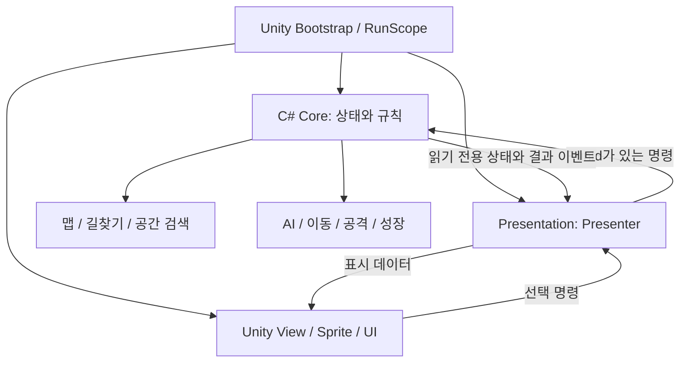
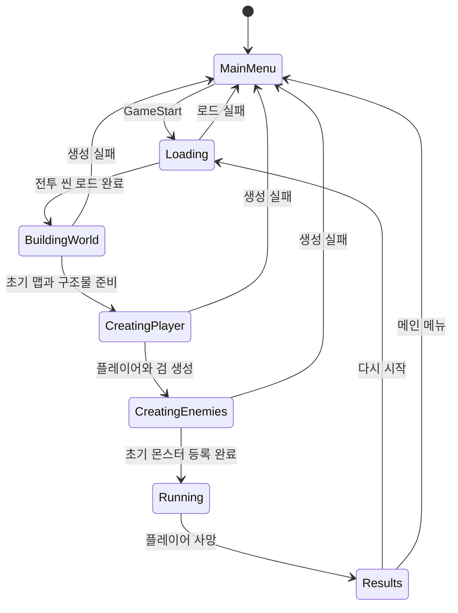

# SsalMuk 구조 설계

- 작성일: 2026-09-16
- 상태: 구조 설계 승인·A~D 기본 기능 구현 · D3 추가 검사는 사용자 지시로 종료(30분 미완료) · 실제 플레이·밸런스 단계
- 기준: [게임 기획서](../../planning/GAME_DESIGN.md), [개발 하네스 설계](../../development/HARNESS.md)
- 적용 프로젝트: `C:/Users/ace21/Desktop/SsalMuk`, Unity `6000.4.6f1`

이 문서는 기획을 구현할 책임 분리, 상태 전환, 데이터 흐름과 검증 경계를 정한다. 2026-09-16 사용자가 구조 설계를 승인하고 구현 계획 작성을 요청했다. 아래 클래스·폴더·도구는 승인된 구현 설계이며, 현재 존재하거나 실행 검증을 통과했다는 의미가 아니다. 실행 순서는 [구현 계획](../plans/2026-09-16-ssalmuk-implementation-plan.md)에 연결한다.

## 1. 선택한 방향과 대안

채택한 구조는 **C# 전투 모델 + Unity 표현부 + MVP**다. 일반·보스 몬스터와 경험치를 보존하므로 전투 데이터를 화면의 GameObject 생명주기와 분리한다. 공중의 돌진 후 퇴장도 모델 규칙으로 처리한다. 게임 규칙은 C# 모델에서 계산하고 Unity는 씬 전환, 입력 UI, 스프라이트와 효과를 담당한다.

| 접근 | 장점 | 이 프로젝트에서의 부담 | 판단 |
| --- | --- | --- | --- |
| C# 모델 + Unity 표현 + MVP | 화면 밖 데이터 보존, 규칙 검증, 밸런스 변경의 경계가 명확함 | 원형 유닛과 격자 장애물의 충돌·공격 판정을 직접 구현해야 함 | 채택 |
| 모든 유닛을 MonoBehaviour·Rigidbody2D 중심으로 구성 | 초기 장면과 물리 반응을 빠르게 확인 가능 | 모든 원거리 몬스터 유지와 씬·풀 수명 관리가 강하게 얽힘 | 초기 구현은 쉽지만 현재 보존 규칙에는 부담 |
| DOTS/ECS 중심 구성 | 많은 개체를 데이터 단위로 처리하는 방향과 잘 맞음 | 도구·학습·디버깅 범위가 늘고 실제 병목 측정 전 도입 비용 발생 | 현재 단계에서 도입하지 않음 |

충돌은 원형 유닛과 격자에 정렬된 고정 구조물로 한정한다. 경사면·회전 강체·복잡한 물리 퍼즐용 엔진을 만드는 범위로 확장하지 않는다. Unity 물리와 별도 모델이 같은 위치·피해를 각각 계산하는 이중 판정은 두지 않는다.

## 2. 수업 요구사항과 패턴

| 요구 / 검토 대상 | 적용 위치 | 설명할 핵심 |
| --- | --- | --- |
| MVP 아키텍처 | 전투 모델, Presenter, Unity View | Model이 결과를 소유하고 Presenter가 View에 전달. 버튼은 명령만 전달 |
| Factory Method, 생성 패턴 | `UnitFactory.Spawn`과 구체 팩토리의 `CreateUnit` | 공통 생성 절차에서 생성 메서드를 호출하고, 하위 팩토리가 유닛의 행동 구성을 결정 |
| Flyweight, 구조 패턴 | `DefinitionCatalog`의 읽기 전용 유닛·무기 정의 공유 | 공통 기본 데이터는 공유하고 체력·위치·강화는 각 개체에 따로 보관 |
| FSM / State | 플레이어 운영 FSM, 지상·공중 몬스터 FSM | 현재 상태별 판단과 진입·종료 처리를 분리하고 전환 이유를 확인 가능하게 함 |
| 맵 생성 | 시드 기반 청크 생성 + 연결 통로 검증 | 방문 순서에 관계없이 같은 청크를 재생성하고 이동 가능성을 확인 |
| 길찾기 | 플레이어 A*, 지상 몬스터 공통 위치 직선 추적 | 플레이어만 경로 탐색. 공중은 출현 시 정한 직선 경로 |
| 자동 유닛 생성·체력 감소·체력 UI | 시작 절차, 피해 처리, HUD와 적 체력 표시 | 씬에 유닛을 배치하지 않아도 둘 이상 생성되고 공격 결과가 UI에 반영 |
| 공통 `unit.cs` 권장 예시 | `UnitModel`의 공통 상태와 조합된 기능 | 공통 데이터는 모으고 플레이어·공중·보스 행동 전체를 거대 부모 클래스에 넣지 않음 |

학습자료의 패턴 1~2개와 아키텍처 1개 요건에는 Factory Method·Flyweight·MVP를 설명 대상으로 삼는다. State는 FSM 구현 이유와 함께 추가로 설명한다. 생성 패턴과 구조 패턴 조합은 자료의 권장 사항을 따른 선택이며, 자료가 모든 패턴을 강제한다고 해석하지 않는다.

`UnitFactory`의 공통 `Spawn`은 생성 요청 검증 → `CreateUnit` 호출 → 고유 ID 부여 → 등록을 수행한다. `PlayerFactory`, `GroundEnemyFactory`, `AirEnemyFactory`가 생성 메서드를 재정의해 각각 `PlayerModel`, `GroundEnemyModel`, `AirEnemyModel`을 반환한다. 세 모델은 `UnitModel`의 공통 상태를 사용하고 특유 행동은 조합된 실행기에 맡긴다. 보스는 `GroundEnemyFactory`에 보스 정의를 전달해 생성하며 조합된 BossCharge가 예고·돌진·대기를 관리한다. 팩토리는 표시 오브젝트 생성 여부와 무관하게 논리 유닛을 생성한다.

## 3. 책임과 의존성



| 조립 단위 | 책임 | 참조 |
| --- | --- | --- |
| `SsalMuk.Core` | 한 판 상태, 월드, 유닛, AI, 이동·피해 판정, 무기, 성장 | UnityEngine에 의존하지 않는 C# |
| `SsalMuk.Presentation` | 메뉴·HUD·보상·결과 Presenter, View 인터페이스 | Core |
| `SsalMuk.Unity` | 시작 조립, 씬 로드, 고정 주기 호출, 에셋 읽기, View, 효과, 진단 연결 | Core, Presentation, Unity |
| EditMode 테스트 | 규칙과 Presenter를 가짜 시계·난수·View로 검증 | Core, Presentation |
| PlayMode 테스트 | 실제 씬·버튼·표시·재시작·오브젝트 회수 검증 | 위 런타임 조립 단위 |

Core 안의 하위 기능은 우선 폴더로 구분한다. 기능마다 조립 단위나 범용 프레임워크를 추가하지 않는다. `RunScope` 한 곳에서 의존성을 명시적으로 연결하며 전역 서비스 검색, 전역 이벤트 버스, 전투 상태 Singleton은 사용하지 않는다.

주요 계약은 `IWorldQuery`(범위·최근접·쓸기 검색), `INavigation`(경로 요청), `IRandomSource`(시드 난수), `IRunCommands`(유효한 판의 명령), `IRunReadModel`(표시용 읽기)이다. 구현을 바꿀 경계에만 인터페이스를 둔다. 외부 코드는 유닛 체력이나 무기 목록을 직접 수정하지 않는다.

## 4. 씬과 한 판의 수명

메뉴·전투 씬은 게임 개체가 없는 시작점으로 둔다. 시작 훅이 `AppRoot`를 만들고 필요한 카메라·UI를 실행 중 구성한다. 부트스트랩용 `GameCatalog`만 정해진 Resources 경로에서 읽으며, 나머지 프리팹과 데이터는 이 카탈로그의 참조로 연결한다. 에셋 참조는 씬에 전투 개체를 미리 배치하는 것과 구분한다.



- `RunCoordinator`가 순서를 관리한다. 초기 생성은 비활성 모델로 완료하고 `Running` 진입 시 이동·공격·생존 시계를 함께 시작한다.
- 연속 클릭은 하나의 전환만 실행한다. 전환 중에는 시작·재시작 버튼을 다시 수락하지 않는다.
- 판마다 새로운 `RunId`, 시드, 모델, 난수 스트림, 예약 이벤트와 `RunScope`를 만든다.
- 씬 로드는 비동기 완료 뒤에 다음 단계를 실행한다. Unity의 비동기 씬 로드 API를 연결점으로 사용한다. [Unity SceneManager.LoadSceneAsync](https://docs.unity3d.com/6000.4/Documentation/ScriptReference/SceneManagement.SceneManager.LoadSceneAsync.html)
- 도중에 취소된 이전 로드 결과는 `RunId`로 식별한다. Unity 로드가 즉시 취소된다고 가정하지 않고 완료 후 이전 판의 결과를 정리한다.
- 사망은 한 번만 처리한다. 결과 스냅샷(생존 시간·처치 수·최종 레벨)을 먼저 복사하고 명령·성장·예약 공격·선택 기회·구독·표시 객체를 종료한다.
- 결과 화면이 읽는 값은 스냅샷이다. 다음 판 생성 시 이전 모델이나 카탈로그 에셋에서 성장 상태를 가져오지 않는다.
- 초기화 실패 시 생성한 항목을 회수하고 메뉴에 실패 상태를 표시한다. 일부만 생성된 판을 자동 전투 상태로 두지 않는다.
- Editor에서 Battle을 직접 실행해도 같은 생성 진입점을 거친다. Domain Reload 설정과 관계없이 중복 AppRoot·구독·이전 판 상태가 남지 않도록 초기화한다.

## 5. 데이터 소유와 기본값

| 데이터 | 소유자 / 수명 | 내용 |
| --- | --- | --- |
| `GameCatalog`, 정의 에셋 | 프로젝트 에셋, 실행 중 읽기 전용 | 유닛·무기 기본값, 프리팹, 스폰·성장·AI·연출 설정 |
| `RunModel` | 한 판 | 시드, 시계, 플레이어, 월드, 처치 수, 성장, 예약 생성 |
| `UnitModel` | 생성부터 사망까지 | ID, 종류, 체력, 논리 위치, 몸 반경, 이동·피격 상태 |
| `WeaponState` | 해당 판의 소유 무기 | 무기 ID, 5종 강화 단계, 공격 스케줄 |
| `OfferState` | 현재 선택 화면 | OfferId, 서로 다른 후보 3개, 제시 시점 소유 상태 버전 |
| `WorldStore` | 해당 판 | 몬스터·경험치 기록, 청크별 공간 색인, 마지막 계산 시점 |
| `ExperienceRecord` | 드롭부터 접촉 획득 또는 판 종료까지 | ID, 실제 경험치 값, 현재 논리 위치, 대기/흡수/획득 상태 |
| `RunResult` | 결과 화면 종료까지 | 종료한 판의 생존 시간·처치 수·최종 레벨 |

정의 에셋은 ScriptableObject로 편집하고 시작 시 검증한 읽기 전용 C# 정의를 카탈로그에 공유한다. 인스턴스별 체력과 강화는 정의 에셋에 쓰지 않는다. ScriptableObject가 GameObject에 부착되는 컴포넌트와 구분되는 에셋 데이터라는 점을 활용한다. [Unity ScriptableObject](https://docs.unity3d.com/6000.4/Documentation/Manual/class-ScriptableObject.html)

ID 중복, 누락된 무기, 0 이하 공격 주기, 음수 체력·가중치, 보스가 통과하지 못하는 최소 통로 설정 등은 전투 시작 전 구성 오류로 잡는다. 임시 수치는 임시 프리셋으로 표시한다. 확정된 검 60도·보스 300초·선택지 3개·무기 4종·강화 5종은 테스트로 유지할 계약이다.

## 6. 월드 생성과 모든 개체 보존

### 6.1 좌표와 청크

맵은 고정 크기 격자 청크로 나눈다. 좌표는 정수 청크 좌표와 청크 내부 실수 좌표로 보관하고 음수 좌표도 바닥 나눗셈으로 정규화한다. Unity 표시 위치는 플레이어 주변 기준점과의 차이로 계산한다. 먼 몬스터의 거대한 전역 좌표를 Unity Transform에 그대로 넣지 않는다.

청크의 구조물은 `RunSeed + ChunkCoord + GeneratorVersion`으로 정해진다. 생성 순서나 레벨업 난수 소비가 지형을 바꾸지 않도록 맵·스폰·선택지 난수 스트림을 분리한다.

2026-09-18 승인에 따라 생성 버전 2는 경계 벽 없이 전체 경계를 연다. 보스 반경에 따른 경계 여백과 넓은 간격의 내부 슬롯을 확보하고, 중앙 8×8 시작 공간을 비워 둔다. 슬롯별 확률로 책장·책상(2×1칸)·의자(1×1칸)를 생성하며 연결된 벽이나 고립된 바닥 주머니를 만들지 않는다. 확률은 가구를 놓을 기회에 적용하며 막힌 면적의 비율이 아니다. 기존 경계 출입 지점은 지역 경로 안내 정보로만 유지한다.

`ChunkData`는 불변 `FurniturePlacement`와 32×32 점유 격자를 함께 보유한다. 가구 종류·변형·위치·크기도 fingerprint에 포함한다. 기울어진 원본 스프라이트의 하단 피벗을 기준으로 `TerrainView`가 런타임 표시하고 Y 정렬을 원점 이동에 맞춰 갱신한다. Collider2D/Rigidbody2D는 추가하지 않으며 Core의 고정된 단순 격자 footprint로 지상 이동을 막는다. 공중·공격 통과와 파괴 불가는 유지한다.

정적 장애물의 행별 비트마스크로 짧은 이동의 전체 원형 쓸기 영역이 비었는지 먼저 검사한다. 비어 있으면 한 번에 이동하고, 가구가 근처에 있으면 기존 정확한 모서리·접선·슬라이드 판정을 수행한다. 긴 이동은 격자 선분 순회를 유지한다. 빈 구역 검사는 출발점·반경·이동 전체를 포함하므로 넉백의 장애물 관통을 허용하지 않는다.

정적 청크의 표시·내비게이션 캐시는 회수 후 같은 결과로 재생성할 수 있다. 구조물 파괴 기록은 필요 없다. 몬스터 이동에 필요한 청크는 화면 밖에서도 데이터만 생성·조회한다.

### 6.2 확정된 보존 계약

**사용자 선택: 경험치와 일반·보스 몬스터를 계속 유지한다.** 2026-09-17 공중 무리는 직선 돌진 후 화면 밖 여유 거리를 벗어나면 퇴장하도록 정정했다. 일반·보스를 가까이 다시 생성하며 체력·위치를 초기화하지 않는다.

- 논리 유닛과 경험치 기록은 `WorldStore`가 보유한다. 표시 오브젝트 회수는 논리 개체 삭제를 뜻하지 않는다.
- 사망한 몬스터, 수집한 경험치, 종료한 판은 정상 규칙에 따라 제거한다. 거리·개체 수·보스 중복을 이유로 제거하지 않는다.
- 2026-09-17 추가 지시로 일반 몬스터의 전체 동시 존재 수를 `normalPopulationCap`으로 제한한다(현재 임시 500, 최초 300에서 후속 변경). 기존 일반 적을 회수하는 방식이 아니라 초기 생성과 지속 소환을 제한한다. `SpawnDirector`는 등록·제거 이벤트로 화면 밖을 포함한 일반 수를 추적한다. 막힌 일반 생성의 예약도 남은 자리만큼만 유지하며, 상한 중 지난 일반 일정은 적립하지 않는다. 보스·공중 일정과 경험치는 이 상한과 독립이다.
- 원거리 지상 몬스터도 추적을 계속한다. 매 고정 주기 시작의 공통 플레이어 위치로 직진하며 개별 경로를 요청하지 않는다.
- 공중 몬스터는 원래 직선으로 진입·통과한다. `AirDepartureSystem`이 공격·사망·접촉 처리 뒤, 진행 방향 기준 카메라 중심을 지난 개체가 화면 밖 여유 거리와 몸 반경까지 벗어났는지 판단한다. 넉백 중에는 기다린다. 퇴장은 Registry에서 제거해 공간 색인·이동/FSM·표시를 회수하되 DeathService를 호출하지 않아 처치·경험치를 지급하지 않는다. 출현 횟수와 자연 퇴장 횟수를 구분해 진단한다.
- 바닥 대기 경험치는 원래 위치·값·ID를 유지한다. 흡수를 시작한 구슬은 현재 논리 위치와 흡수 상태를 보존해 플레이어 추적을 계속한다. 이동 거리나 화면 이탈로 삭제하거나 자동 획득하지 않는다.
- 가까운 표시 객체에는 진입·이탈 거리 차이를 두어 경계에서 반복 생성되지 않게 한다. 공격·피격 가능 영역은 카메라 표시 영역과 별도로 계산한다.
- 범위가 큰 무기는 화면 밖 대상도 조회한다. 청크가 표시되지 않았다는 이유로 피해나 경험치 드롭이 누락되어서는 안 된다.

일반 몬스터 수에는 명시된 상한이 있지만 보스와 경험치 기록은 계속 유지하므로 시간에 따라 메모리와 계산량은 증가할 수 있다. 표시 풀링이나 일반 상한만으로 모든 누적 부하가 해결된다고 보지 않는다. 지원 가능한 플레이 시간·누적 개체 수는 측정 결과로 보고하며, 부족할 때 임의 삭제로 규칙을 바꾸지 않는다. 앱 종료 후 이어하기나 영구 저장은 현재 기획 범위에 없다.

## 7. 길찾기·군집·이동 판정

| 대상 | 경로 선택 | 근접 이동 |
| --- | --- | --- |
| 플레이어 | 경험치 가치·위험을 반영한 A* | 기존 low AI 회피·돌파와 원형 이동 쓸기 유지 |
| 일반·원거리 지상 몬스터 | 같은 주기 시작의 플레이어 위치로 직진 | 개별 경로 탐색·군중 회피 없이 지형 정지·슬라이드 |
| 보스 | 평소 직선 추적, 예고 시 돌진 방향·끝점 고정 | 추적 1.2배, 돌진 2배 속도와 지형 충돌 |
| 공중 | 출현 시 정한 직선 | 구조물·지상 밀집 무시, 접촉 쓸기와 화면 밖 퇴장 유지 |

`MovementSystem`은 매 고정 주기 시작에 플레이어의 위치·생존·속도를 `SharedPlayerPosition`에 한 번 복사한다. 모든 적이 읽기 전용 `IPlayerPosition` 계약을 공유하므로 유닛 갱신 순서에 따라 서로 다른 위치를 보지 않는다. `GroundChaseBehavior`는 현재 위치에서 공통 목표까지의 방향만 계산한다. `NavigationService.ChaseDirection`과 `CrowdSolver`는 몬스터 실행 경로에서 호출하지 않는다. 기존 탐색 구현은 플레이어와 독립 검증용으로 남아 있다.

지상 몸체는 원이며 `CircleSweep.MoveAndSlide`가 가구 통과를 막는다. 막힌 몬스터는 스스로 우회하지 않는다. 지상 적끼리는 겹침을 허용하고 밀어내기·방향 회피를 적용하지 않는다. 공격 피격 넉백, 매 고정 주기 이동, 접촉 피해·정확한 무기 판정은 유지한다. 공간 해시는 최근접·주변 적·경험치·접촉·공격 후보 조회에 계속 사용한다.

`UnitDefinition.BodyRadius`는 지형·접촉 판정, `HurtRadius`는 근접 공격·투사체·폭발의 피격 판정, `VisualFootOffset`은 표시 발 위치다. 표시 스프라이트의 짧은 변을 원형 기준 지름으로 삼아 실제 에셋에 몬스터 BodyRadius=지름×0.5, 플레이어 BodyRadius=지름×0.4, HurtRadius=지름×0.55를 기록하고 이전 발 위치를 보존한다. 몬스터 몸통 100%는 2026-09-18 후속 지시다. 타격 후보 조회에는 LargestHurtRadius를 포함해 몸통 밖의 유효한 명중 대상을 빠뜨리지 않는다. 난이도·진단용 정의 복사도 세 값을 보존한다. Core는 Unity 스프라이트를 참조하지 않는다.

표현부는 고정 주기 시작 시 저장한 `UnitModel.PreviousPosition`과 현재 위치를 렌더 보간한다. 플레이어 기준 원점도 같은 비율로 보간해 군집·지형이 카메라에 대해 떨리지 않게 한다. 모델·충돌·공격 위치는 보간으로 수정하지 않는다. 새 개체의 이전 위치는 생성 위치이며, 큰 청크 좌표를 유지한 상대 변위로 계산한다. 몬스터의 좌우 기울임·점프 보행은 제거하고 플레이어 보행과 모든 유닛의 피격 반응은 유지한다.

| 조합 | 몸체 막힘·밀집 | 피해 |
| --- | --- | --- |
| 플레이어 ↔ 구조물 | 막힘 | 없음 |
| 지상 적 ↔ 구조물 | 막힘 | 없음 |
| 지상 적 ↔ 지상 적 | 겹침 허용, 방향 회피 없음 | 서로에게 없음 |
| 플레이어 ↔ 지상 적 | 겹침 허용, 강제 분리 없음 | 작은 몸통의 접촉 피해 후보 |
| 공중 ↔ 지상·구조물·공중 | 통과 | 서로에게 없음 |
| 공중 ↔ 플레이어 | 지나감 | 이동 구간의 접촉 피해 후보 |

## 8. FSM과 공격의 독립성

### 8.1 플레이어

최상위 생명 상태는 `Alive / Dead`다. 살아 있는 동안 아래 운영 FSM이 이동 입력과 돌파 목표 방향을 만든다. 공격 스케줄과 피격 반응은 별도 실행기로 둔다. 상태 객체는 `IBehaviorState`의 `Enter / Tick / Exit` 계약을 따르고, 전환은 FSM 소유자 한 곳에서 수행한다. 전환 이유·시각·이전/다음 상태를 진단에 제공한다.

| 운영 상태 | 진입·동작 | 종료 |
| --- | --- | --- |
| `Collect` | 접근 가능한 경험치 중 가치·거리·위험을 점수화해 수집. 없으면 감지한 가장 가까운 적의 근접 사거리 안으로 접근·감속 | 긴급 충돌이면 Evade, 주변 경로가 막히면 Breakout |
| `Evade` | 예상 접촉 시간과 통과 여유를 비교해 짧게 회피. 무적 시간도 판단 입력으로 사용 | 위험이 낮아진 상태를 일정 시간 유지하면 Collect, 포위되면 Breakout |
| `Breakout` | 장애물이 아닌 방향 중 적 밀도·앞을 막는 체력·통과 거리를 평가해 방향 하나를 고정 | 빠져나갈 공간을 확보하고 안정 시간이 지나면 Collect. 구조물로 막히거나 진행이 없으면 방향 재선정 |

판단 우선순위는 사망 → 포위 돌파 → 긴급 회피 → 경험치 수집·교전 접근이다. 수집 상태의 이번 이동 의도를 먼저 계산하고 같은 의도로 접촉을 예측한다. 이전 전속력 접근 입력으로 사거리 직전에 회피하지 않도록 접근 시 감속하며, 현재 보유한 근접 무기의 강화 사거리를 매 주기 반영한다. 파이어볼 폭발 반경은 교전 접근 거리에 쓰지 않는다. Breakout에서는 작은 국소 회피를 허용하되 매 판단마다 탈출 방향을 뒤집지 않는다. 진입·종료 임계값을 다르게 두고 목표 유지 시간으로 진동을 줄인다. 위험한 경험치도 선택할 수 있지만 이동 불가능한 구조물 내부를 목표로 삼지는 않는다.

일반 목표는 가장 가까운 살아 있는 적이다. Breakout에서는 선택한 통로를 막는 적 중 가까운 대상을 우선하고, 해당 후보가 없으면 일반 목표로 돌아간다. 거리 동률은 ID로 결정한다. AI는 정규화된 `MoveIntent`와 `TargetIntent`만 출력하며 실제 Transform·체력·View를 수정하지 않는다.

### 8.2 몬스터와 피격

| 대상 | 상태 전환 |
| --- | --- |
| 일반 | `Chase → Knockback → Chase`, 어느 상태에서든 `Dead` 가능 |
| 보스 | `Chase → Telegraph → Charge → Chase`, 넉백·사망·지형 차단은 돌진 취소 |
| 공중 | `FlyThrough → Knockback → FlyThrough`, 어느 상태에서든 `Dead` 가능 |
| 플레이어의 이동 실행 | 정상 이동과 일시적 넉백 변위를 합성. Dead에서 모든 실행 종료 |

보스는 0.5초 빨간 예고 후 플레이어 속도의 2배로 돌진한다. 예고 시 방향과 끝점을 고정하며 길이는 보스-플레이어 거리의 2배, 폭은 보스 몸통 지름이다. 30% 확률로 한 번만 추가 돌진하며 새 위치에서 다시 0.5초 예고한다. 묶음 종료 뒤 5초 동안 추적하다 다시 예고한다. 판 시드·유닛 ID에서 분리한 난수는 스폰·보상 난수에 영향을 주지 않는다. 표시 풀 회수·사망·넉백 때 예고를 숨긴다. 일반·공중 속도는 플레이어 1.1배, 보스 추적은 1.2배다.

넉백은 짧은 시간 원래 이동보다 우선하며, 종료 후 이전 추적 또는 저장한 공중 진행 방향으로 복귀한다. 피격 중 재피격은 피해 규칙을 따른다. 새 넉백은 현재 위치에서 새 방향·세기로 갱신하며 무적·보스 면역을 암묵적으로 추가하지 않는다.

플레이어 공격은 정지·걷기·회피·돌파·살아 있는 피격 상태에서 독립적으로 진행한다. 걷기 연출은 low AI 입력에만 반응한다. 공격이나 넉백 자체가 걷기 입력을 만들지 않는다.

## 9. 고정 주기와 피해의 단일 처리

Unity의 실행부 한 곳에서 고정 간격으로 `RunSimulation.Step`을 호출한다. 개체마다 Update를 만들지 않는다. 생존 시간은 실제로 처리한 Running 단계의 누적 시뮬레이션 시간이며, 로딩 시간을 제외한다. 레벨업 창은 시계나 `timeScale`을 변경하지 않는다.

한 주기의 처리 순서를 고정한다.

1. 판과 OfferId가 유효한 보상 선택 명령을 반영한다.
2. 시계를 전진시키고 예정된 스폰을 등록한다.
3. 필요한 지형·경로·AI 입력을 갱신하고 이동·넉백·군집을 계산한다.
4. 예정 공격과 투사체 이동을 실행하고 적 피해·사망·처치·경험치 드롭을 반영한다.
5. 생존한 적의 접촉 후보를 정리해 플레이어 피해를 적용한다. 치명타가 발생하면 판을 즉시 종료한다.
6. 살아 있는 플레이어 주변 구슬의 흡수 시작·비행·몸 접촉을 계산하고, 접촉한 구슬만 한 번 지급해 레벨업·선택 기회를 처리한다.
7. 읽기 전용 상태와 이벤트를 표시부로 전달한다.

동일 주기에서 플레이어가 먼저 처치한 적은 이후 접촉 피해를 주지 않는다. 같은 주기의 복수 접촉은 충돌 시점과 ID로 순서를 정하고, 처음 수락한 피해가 즉시 짧은 무적을 시작하게 한다. 무적 중 거절된 후보는 빨간 점멸·팽창·넉백을 다시 발생시키지 않는다.

`DamageService`만 체력을 변경한다. `AttackId + CopyId + RepeatId + TargetId`로 한 번의 유효 타격을 구분한다. 중복 콜백·다중 부위·풀 재사용 때문에 같은 타격이 두 번 적용되지 않게 한다. 적 사망과 경험치 드롭도 한 번만 발생한다. 관통 검사는 이동 전후 위치를 사용해 빠른 공중 몬스터나 투사체가 프레임 사이를 통과하는 상황을 잡는다.

표시 프레임과 주기 실행은 분리한다. 느린 프레임에서 예정 공격을 버리지 않고 예약을 처리하며 처리 지연을 계측한다. 모든 기기·버전에서 물리와 화면까지 완전히 동일한 재현을 보장하지 않는다. 같은 모델 버전·시드·고정 입력 순서에서 규칙 결과를 재현하는 것이 하네스의 목표다.

## 10. 무기와 공격 스케줄

무기마다 하나의 `WeaponRuntime`과 종류별 공격 실행기를 둔다. `TargetResolver`는 공통 목표 정책을 사용하며 각 발동 때 목표를 정한다. 발동한 타격·투사체의 방향과 수치는 해당 발동의 스냅샷으로 고정한다. 이후 목표 사망이나 레벨업이 이미 발사된 공격을 순간 회전시키거나 소급 강화하지 않는다. 다음 발동부터 갱신된 상태를 쓴다. 대상이 없으면 준비 상태에서 기다리고 빈 시간의 공격을 적립하지 않는다. 대상을 다시 찾으면 정상 발동부터 시작한다.

| 무기 | 판정과 표현 | 한 대상에 대한 타격 |
| --- | --- | --- |
| 검 | 목표 방향의 60도 부채꼴을 따라 휘두르는 반투명 궤적, 강화는 길이 증가 | 한 복사본의 한 휘두르기에서 1회 |
| 창 | 목표 방향으로 뻗는 찌르기 구간, 강화는 길이 증가 | 한 복사본의 한 찌르기에서 1회 |
| 대형 도끼 | 플레이어 중심으로 한 바퀴 도는 날의 쓸기 구간, 강화는 반경 증가 | 한 복사본의 한 회전에서 1회 |
| 파이어볼 | 직선 투사체가 이동 구간의 첫 적에 닿으면 한 번 폭발 후 소멸 | 폭발당 대상별 1회. 명중 대상에 직격·폭발 피해를 이중 합산하지 않음 |

검·창·도끼는 궤적에 들어온 여러 적을 타격할 수 있다. 파이어볼은 여러 적을 관통하지 않는다. 수신 대상 종류에 공중 몬스터도 포함하며, 공중의 구조물 통과가 공격 면역을 의미하지 않는다.

채택한 공격 판정은 **구조물이 이동만 막고 무기 공격은 통과**하는 것이다. 구조물에는 체력·파괴 처리를 두지 않는다. 2026-09-18 승인에 따라 파이어볼은 현재 카메라 경계 밖 2월드 단위+투사체 반경에서 소멸하며 최대 수명 3초도 유지한다. 경계나 수명 소멸은 폭발 피해를 만들지 않는다. 한 갱신의 비행을 경계 도달 시각까지 잘라 더 먼 적에게 먼저 명중하는 것을 막고, 그 이전 실제 접촉은 정상 폭발한다. 카메라 이동으로 이미 경계 밖인 투사체도 회수한다. RunSimulation이 매 주기 현재 경계를 전달하며 카메라를 지정하지 않은 독립 Core 실행만 수명 기준을 쓴다. 공중·일반·보스·경험치의 생존 규칙과는 별도다.

개수 강화 단계가 n이면 논리 복사본 수는 `1 + n`이다. 2026-09-18 최신 정정에 따라 한 단계에 한 개만 좌우 번갈아 추가한다. 네 무기 모두 같은 플레이어 원점에서 기본 목표 방향 기준 `0, +15, -15, +30, -30, ...`도로 발사한다. 도끼는 이 방향을 회전 시작 위상으로 쓴다. 검의 자체 쓸기는 60도로 유지한다. 큰 정수 단계는 각도로 바꾸기 전에 정수 나머지로 처리하며 360도를 넘더라도 무기 수를 줄이지 않는다. AttackInstance에 복사본 방향을 한 번 적용하고 실제 판정·표시가 공유한다. 기존 CopySpacing 직선 간격은 더 이상 배치에 쓰지 않는다. 복사본별 판정 ID를 달리해 실제 타격 증가를 유지한다.

파이어볼은 한 고정 주기의 모든 예약 발사를 생성한 뒤 각 투사체의 생성 시각부터 그 주기 끝까지 한 번씩 계산한다. 반복 발사마다 살아 있는 전체 투사체를 다시 훑지 않으며 발사 수나 예약을 버리지 않는다. 비행·폭발 후보 목록을 별도 재사용하고 비행 구간 중점 중심의 보수적 원으로 후보를 찾은 뒤 기존 상대 이동 첫 접촉 판정을 적용한다.

연속 공격은 반복 인덱스와 반복 간격을 가진 예약이다. 공격 속도는 무기 주기를 줄이고, 연속 횟수는 주기 안에서 발동할 횟수를 늘린다. 묶음 내 간격을 주기 대비 비율로 정의해 반복 수가 늘어도 다음 묶음을 임의로 취소하지 않는다. 공통 목표는 각 반복 발동 때 재평가하며, 해당 반복의 복사본은 같은 목표 방향을 기준으로 배치한다.

표시 효과와 판정은 같은 `AttackShape` 데이터를 읽는다. 화면 효과 크기만 커지고 실제 사거리가 그대로인 상태를 허용하지 않는다. 화면 표시가 끝나도 예약·투사체 수명을 별도로 관리한다.

## 11. 무한 성장과 선택지

### 11.0 경험치 구슬의 흡수

`ExperienceRecord`는 ID·BigInteger 값·WorldPosition·`Grounded/Attracting/Collected` 상태를 가진다. `ExperienceCollector`가 고정 주기에서 근접한 대기 구슬을 흡수 상태로 바꾸고, 살아 있는 현재 판의 플레이어 위치로 이동시킨다. 흡수 시작 거리와 몸 접촉 거리는 다르며, 반경 진입만으로 값을 더하거나 레코드를 제거하지 않는다.

흡수 상태는 한 번 시작하면 유지한다. 구슬은 구조물·몬스터를 통과하며 현재 플레이어 위치를 따라간다. 이동 전후 상대 구간으로 몸 접촉을 확인해 빠른 구슬이 플레이어를 넘어가도 획득을 놓치지 않는다. `Collected` 전환을 한 번만 수락한 뒤 ProgressionService에 실제 값을 전달하고 레코드를 정리한다. 사망 주기에는 9절의 피해 순서가 우선하며, 종료한 RunId의 지급은 거절한다.

WorldStore의 위치·청크 색인을 비행과 함께 갱신하고, low AI는 `Grounded` 구슬만 새 수집 목표로 삼는다. 흡수가 시작된 목표는 해제한다. 표시가 없거나 풀에 반환되어도 논리 비행·접촉 판정은 유지한다. Unity의 Tween·애니메이션 종료 콜백은 경험치를 지급하지 않는다.

색 등급은 저장된 실제 값과 설정된 구분선으로 계산하며 초록 < 파랑 < 빨강 순이다. 색 때문에 값을 줄이거나 상한을 두지 않는다. 흡수 반경·속도·구슬 몸 반경·색 구분선은 편집 가능한 설정이며 정확한 수치는 밸런스 조정 대상이다.

### 11.1 강화 수치

2026-09-18 최신 지시로 연속 공격 강화만 최대 2레벨(기본 포함 3연타)이며 나머지 4종 강화와 누적 선택 기회는 상한을 두지 않는다. GrowthService는 초과 요청을 부분 적용 없이 거절하고 WeaponState에도 같은 제한을 둔다. 상한에 도달한 후보는 OfferGenerator에서 제외한다. 이미 표시·예약된 후보가 그사이 상한에 도달했다면 RewardService는 선택 기회를 소비하지 않고 후보를 새로 만든다. 단계는 `System.Numerics.BigInteger`로 보존하고, 저장·진단에는 문자열로 직렬화한다. Unity Inspector에서는 기본값과 증가 계수를 편집한다. 큰 정수 표현과 처리량은 구분한다.

성장은 정의의 기본값·증가 계수와 강화 단계로 매번 계산한다. 스탯을 계속 곱해 원본을 잃거나 다음 판으로 누적하지 않는다. 수치 계수는 조정 대상으로 남기되 공격력·개수·반복·속도·범위 각각의 강화가 해당 무기에 반영되도록 한다.

계산용 시간·거리·체력은 우선 배정밀도 수치로 운용하되 변환 시 유한성·양수 주기·연속 증가를 검사한다. 지원 범위를 넘어 무한대, 0초 주기, 이전과 같은 값이 나오면 검증 실패로 드러낸다. 이를 최대 강화 레벨로 숨기거나 임의 Clamp로 정상 처리하지 않는다. 큰 정수 단계만 사용했다고 모든 전투 수치와 무한 개수 처리가 해결된 것으로 보지 않는다.

표시용 객체 수와 논리 타격 수를 구분한다. 효과를 묶어 그리더라도 실제 발동·피해·경험치 결과는 유지해야 한다. 복사본과 반복을 생략하거나 전부 단일 피해 배율로 바꾸는 최적화는 궤적·처치 시점까지 동등성이 검증되지 않으면 적용하지 않는다. 큰 수치 표현의 확장과 장시간 처리량은 스트레스 검증 결과에 따라 구현 범위를 세분화할 항목이다. 무한 시간 동안 일정 성능을 유지한다는 약속은 하지 않는다.

### 11.2 선택지 처리

`RewardService`가 소유 상태를 기준으로 후보를 생성하고, `OfferGenerator`가 가중 비복원 추출로 3개를 제시한다.

1. 미보유 무기 획득 후보와 보유 무기의 5종 강화 중 현재 강화 가능한 후보를 만든다. 연속 공격 2레벨에 도달한 무기의 해당 후보는 제외한다.
2. 설정한 신규 무기/강화 범주 가중치를 적용하고, 후보를 하나 뽑을 때마다 해당 후보만 임시 목록에서 제거한다.
3. 선택한 범주에 후보가 없으면 가능한 범주에 가중치를 다시 정규화한다. 모든 무기를 얻었으면 강화 후보만 사용한다.
4. 서로 다른 후보가 3개 모이면 고정된 OfferId로 표시한다. 확률 설정이 유효한 서로 다른 후보 3개를 만들 수 없으면 시작 전 구성 오류로 잡는다.
5. 선택 명령은 RunId·OfferId·선택 ID·소유 상태 버전을 확인해 한 번만 적용한다. 이중 클릭이나 종료한 판의 명령은 무시한다.
6. 소유 상태를 갱신하고 기회 하나를 소비한 뒤, 남은 기회가 있으면 새 소유 상태로 다음 선택지를 생성한다.

선택 기회는 누적 개수로 저장하고 아직 보이지 않을 선택지들을 미리 생성하지 않는다. 현재 화면의 세 후보는 추가 레벨업만으로 바뀌지 않는다. 경험치가 여러 레벨을 넘으면 필요한 만큼 레벨과 선택 기회를 증가시키며, UI 표시가 느려도 보상을 잃지 않는다. 사망 시 현재 OfferId를 폐기하고 모든 기회를 초기화한다.

## 12. 스폰과 난이도

`SpawnDirector`는 생존 시계 하나를 기준으로 일반·공중·보스의 독립 일정을 관리한다. 난이도 곡선은 시간에 따른 생성량과 생성 시 기본 스펙을 정한다. 이미 살아 있는 적의 체력을 난이도 상승 때 갑자기 회복시키지 않도록 생성 시 스펙을 고정한다.

2026-09-18부터 SurroundWaveSchedule을 추가해 120초마다 전방위 일반 웨이브를 예약한다. 기본 80마리이며 직전 웨이브의 실제 생성 ID와 초반 처치를 추적한다. 45초 내 처치 비율 80% 이상이고 다음 웨이브 시 맵 전체 일반 수가 이전 생성 수의 25% 이하일 때만 한 단계 올린다. 살아 있는 개체의 수동 제거, 생성되지 않은 예약, 표본 없는 구간은 처치로 인정하지 않는다. 한 단계마다 요청 수 +20, 기본 체력 배율 +0.2, 피해 배율 +0.1이며 기존 시간 배율과 곱한다. 수치는 SurroundWaveSettings와 DevelopmentDefaults에 둔다.

웨이브도 일반 상한 500을 공유하며 남은 자리만 예약한다. 현재 카메라를 확장한 사각형 밖 8각도 구역을 교차하며 지형·다른 몸통과 겹치지 않는 후보를 찾는다. 기존 생성 예산 64 안에서 보스→웨이브→나머지 예약 순으로 처리한다. 막힌 웨이브 예약은 실제 예약 후 5초까지만 재시도하며 이미 생성된 적은 제거하지 않는다. 여러 경계를 한 번에 넘겨도 각 일정 ID는 한 번만 만들고, 새 판에는 단계·예약·추적 ID가 남지 않는다.

- 보스 일정은 300초, 600초, 900초처럼 최초 전투 시작 기준이다. 이전 보스의 생존 여부를 조건으로 삼지 않는다.
- 경계 시간을 넘으면 도래한 보스·공중 일정을 각각 한 번 예약한다. 긴 주기나 생성 지연 때문에 이 일정을 건너뛰지 않고, 보스 일정 ID로 재시도 중 중복 생성을 막는다. 일반은 실제 개체와 대기 예약을 합해 상한 안의 자리만 예약하고 나머지 도래분은 건너뛴다.
- 일반·보스는 카메라 밖의 이동 가능한 바닥에서 생성한다. 구조물·플레이어·기존 지상 몸체와 겹치면 주변 후보를 찾고, 후보가 없으면 해당 예약을 유지해 재시도한다.
- 공중은 일정마다 화면 한쪽을 시드 난수로 고르고 한 무리를 생성한다. 무리 기준점에서 출현 당시 플레이어 위치로 향하는 방향 하나를 고정해 평행하게 통과시킨다. 이후 플레이어를 유도 추적하지 않는다.
- 공중도 피격과 사망이 가능하며 실제 처치에는 정상 보상을 준다. 생존한 공중 몬스터는 원래 방향으로 계속 진행하다 출구 쪽 화면 밖 여유 거리에서 무보상 퇴장한다. 진입 중인 무리를 거리만으로 삭제하지 않는다.
- 일반은 사용자 승인 상한에 따라 추가 생성을 제한하며 기존 개체를 바꾸지 않는다. 공중·보스의 다음 일정은 일반 개체 수와 독립적으로 유지한다.

## 13. 표현부와 UI

플레이어·몬스터는 AI로 제작한 투명 배경의 단일 스프라이트를 사용할 수 있다. 공격 효과는 조사한 2D 에셋을 도입하되 판정은 Core가 소유한다. 아트 제작·후보·도입 조건은 [아트·이펙트 기준](../../planning/ART_AND_VFX.md)을 따른다.

플레이어 표시 계층은 `UnitViewRoot → WalkPivot → HitScaleRoot → Sprite`로 분리한다. Root는 논리 위치를 표시하고, WalkPivot은 바닥 기준 기울기와 상승·하강, HitScaleRoot는 피격 팽창을 담당한다. 몸 반경은 팽창·점프의 영향을 받지 않는다. 2026-09-17 추가 지시로 모든 유닛의 바닥 그림자는 프리팹과 런타임 생성 경로에서 제거한다. 무기 표시 기준점은 걷기·피격 자식과 분리해 본체 기울기가 공격 판정을 회전시키지 않게 한다.

이동 입력이 있을 때 왼쪽 상승 → 정자세 하강 → 오른쪽 상승 → 정자세 하강을 반복한다. 입력이 끊기면 정자세로 돌아오며, 공격은 이 주기를 시작하거나 유지하지 않는다. 실제로 수락된 피격 이벤트만 빨간 점멸 1회·팽창 후 복귀를 실행한다. 근접한 여러 피격 연출은 최신 이벤트 기준으로 재시작하되 피해 횟수 자체를 합치지 않는다.

`WorldPresenter`가 읽기 모델에서 표시할 유닛·경험치·공격 목록을 받아 월드 View에 생성·갱신·회수 요청을 전달한다. 유닛마다 전역 Presenter를 만들지 않고 ID별 표시 연결을 월드 단위로 관리한다. 화면 좌표 변환·보간·색·메시는 Unity View가 처리하며 피해와 이동 규칙은 계산하지 않는다.

`ExperienceView`는 작은 원형 중심과 같은 색의 반투명 빛 번짐을 표시한다. 초록·파랑·빨강을 구분하고 논리 위치를 따라 비행을 보간한다. 외곽 빛의 크기는 접촉 반경을 바꾸지 않는다. 공격 에셋도 AttackShapeSnapshot의 형상·방향·진행률에 맞춰 재생하고, 에셋 자체의 피해 콜백은 연결하지 않는다.

MVP UI는 MainMenu, HUD, LevelUp, Results로 나눈다. HUD에는 플레이어 체력·경험치·레벨·생존 시간·처치 수와 보유 무기를 표시한다. 적 체력 표시는 보이는 유닛 위에 붙여 실제 체력 감소와 연결한다. 레벨업 화면에는 3개 선택과 남은 선택 기회를 표시하며 전투를 계속 볼 수 있게 배치한다.

View는 체력 계산·후보 생성·씬 수명을 결정하지 않는다. Presenter는 이벤트 구독을 수명 안에서만 유지하고 View가 없어도 모델은 진행한다. 버튼 이벤트가 한 프레임에 여러 번 도착해도 모델의 명령 검증을 통과해야 보상이 적용된다.

표시 풀은 모델 ID와 대여 세대를 함께 가진다. 회수 시 ID·구독·색·크기·회전·걷기 위상·이펙트·예약 종료 콜백을 초기화한다. 이전 대여의 늦은 이벤트가 새 몬스터를 점멸시키거나 반환하지 않게 한다. 먼 개체의 View 회수는 UnitModel 회수와 별도 작업이다.

## 14. 파일 배치와 도입 순서

다음 배치는 구현 시 생성할 대상이다.

```text
Assets/_SsalMuk/
  Core/                 Session, Units, World, Navigation, AI, Combat, Progression
  Presentation/         Presenters, ViewContracts
  Unity/                Bootstrap, Configuration, Views, Diagnostics
  Content/              Definitions, Prefabs, Materials, Sprites
  Resources/Bootstrap/  GameCatalog.asset
  Scenes/               MainMenu.unity, Battle.unity
  Tests/EditMode/       규칙·생성·FSM·길찾기·성장·Presenter
  Tests/PlayMode/       씬 수명·표시·전투 연결·재시작
  Editor/               정의 검증·진단 실행 연결
tools/validation/       검증 진입 스크립트와 결과 판독기
docs/development/       하네스 계약
```

도입은 실행·검증 토대 → 생성·맵·이동 → AI·피격·검 전투 → 경험치·보상·나머지 무기 → 무한 유지·스폰·연출 통합 순서로 나눈다. 모든 단계는 최종 구조를 향한 부분 구현으로 표시하며, 첫 검 전투가 된 시점을 전체 게임 완료로 처리하지 않는다. 구체적인 파일·테스트·실행 순서는 [구현 계획](../plans/2026-09-16-ssalmuk-implementation-plan.md)에 정리했다.

## 15. 승인 범위와 완료 기준

이번 설계의 선택은 MVP, Factory Method, Flyweight, 모델과 표시 분리, 격자·원형 판정, FSM·길찾기 방식이다. 원거리 경험치·일반·보스 보존과 공중의 돌진 후 퇴장은 대화에서 확정한 규칙이다.

공격의 구조물 통과, 파이어볼 비행 수명, 발동당 피해 중복 기준, 공중 무리 평행 진행, 기존 몬스터의 생성 시 스펙 유지와 동일 주기의 피해 순서는 사용자에게 제시한 구조의 일부로 채택했다. 몬스터 밀집의 표현 방식도 설명 후 확인했다. 이번 승인으로 같은 구조를 다시 승인받을 필요는 없으며, 게임 규칙이 달라지는 변경은 별도로 구분한다.

수치 조정 대상으로 남는 것은 체력·속도·피해·성장 계수·경험치 요구량·등장 확률·스폰량·AI 위험 임계값·피격 시간·표시 거리다. 실수 표현 범위와 누적 개체 처리량은 단순 밸런스 수치가 아니라 구현·검증해야 할 기술 한계다.

2026-09-16 추가 지시로 AI 캐릭터·몬스터 스프라이트 사용, 외부 2D 공격 이펙트 조사, 초록·파랑·빨강의 발광 원형 경험치와 접근 후 비행·접촉 획득을 반영했다. 구체적인 외부 에셋은 후보이며 취득·적용 완료로 간주하지 않는다.

구조 설계의 완료 기준은 기획과 책임 연결, 데이터 수명, 상태 전환, 실패 처리, 검증 시나리오가 문서에서 이어지는 것이다. 실제 게임의 완료는 하네스의 검증 기준을 구현하고 확인한 뒤 판단한다.
